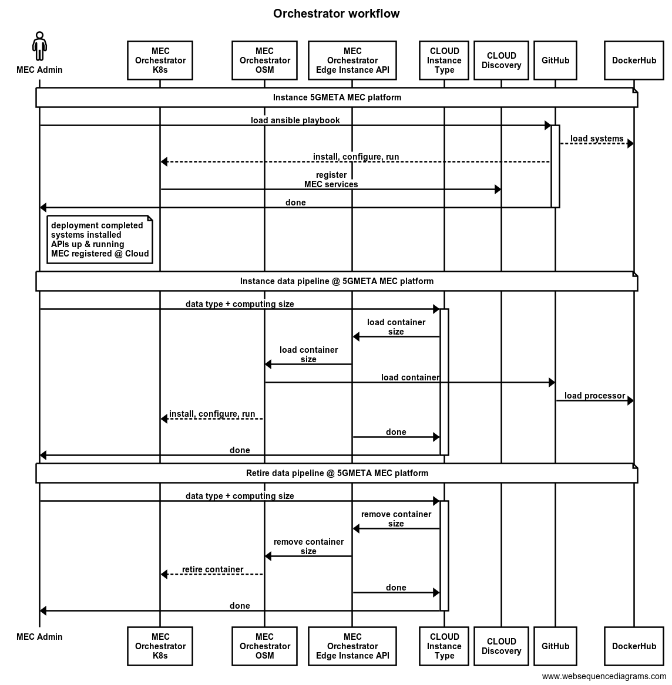

# Orchestrator

## Overview
This project contains all the components necessary to get a working Edge Stack where the pipelines requested from a third-party will be deployed to handle specific data-types.

This repo includes:
 - the scripts to deploy the 5GMETA MEC platform stack,
 - the definition of APIs and
 - the systems that manage the processing of data in a edge infrastructure.

## Deployment of the Edge Stack
The deployment process of the 5GMETA Edge Stack is described in [deploy](https://github.com/5gmeta/orchestrator/tree/main/deploy) folder.

## APIs
The source code of the APIs running in the MEC can be found in [api](https://github.com/5gmeta/orchestrator/tree/main/api) folder.

## MEC scripts
Scripts and folders needed for the different tasks triggered in the MEC can be found in [src](https://github.com/5gmeta/vnfdescriptors/tree/main/src) folder.

## Development of a pipeline
The development of a pipeline beggins on the creation of the different module images. Next, a helm chart should be created where the behaviour of the modules in a MEC's K8s cluster are defined. Finally the OSM descriptor should be created so that the pipeline is orchestrated in the MEC.

## Flow for a pipeline deployment in the MEC
When a third party requests for a data type in the cloud, after all the necessary operations are made in the cloud, the cloud will forward the request to the Instance API in the selected MEC. This API will check if there are available resources in the MEC to deploy the data-type pipeline for the requested instance type. If available, the request will be forwarded to the OSM Orchestration API and the pipeline will be deployed.

## Repositories
- Docker Hub: https://hub.docker.com/orgs/5gmeta
- Helm Chart repository: https://github.com/5gmeta/helmcharts
- OSM descriptors repository: https://github.com/5gmeta/vnfdescriptors

## Terms definitions
- Dataflow: is a unique flow/stream of produced data that is shared by a S&D through a Pipeline in a MEC. 
- Data-type: is a type of data that the S&D share and a Piepeline in a MEC accept and handle. 
- Pipeline: is a group of Modules (containers) running in a MEC to handle a specific data-type. Each modules can process the data received subscribing a queue/topic and generate output data in a new queue/topic into the MEC’s message broker.  
- Module: is a container running in a MEC that hande a specific data-type or group of data-type (e.g. C-ITS messages). Modules should be Pub/Sub application. 
- Third Party application:: is an application/service lying outside the 5GMETA Platform, which act as a Third Party, consuming 5GMETA Data, and potentially pushing events to the 5GMETA platform (e.g. a CCAM application).

## Authors
- Mikel Serón Esnal ([mseron@vicomtech.org](mailto:mseron@vicomtech.org), [GitHub](https://github.com/mikelseron))
- Felipe Mogollón ([fmogollon@vicomtech.org](mailto:fmogollon@vicomtech.org))

## License

Copyright : Copyright 2022 VICOMTECH

License : EUPL 1.2 ([https://eupl.eu/1.2/en/](https://eupl.eu/1.2/en/))

The European Union Public Licence (EUPL) is a copyleft free/open source software license created on the initiative of and approved by the European Commission in 23 official languages of the European Union.

Licensed under the EUPL License, Version 1.2 (the "License"); you may not use this file except in compliance with the License. You may obtain a copy of the License at [https://eupl.eu/1.2/en/](https://eupl.eu/1.2/en/)

Unless required by applicable law or agreed to in writing, software distributed under the License is distributed on an "AS IS" BASIS, WITHOUT WARRANTIES OR CONDITIONS OF ANY KIND, either express or implied. See the License for the specific language governing permissions and limitations under the License.
